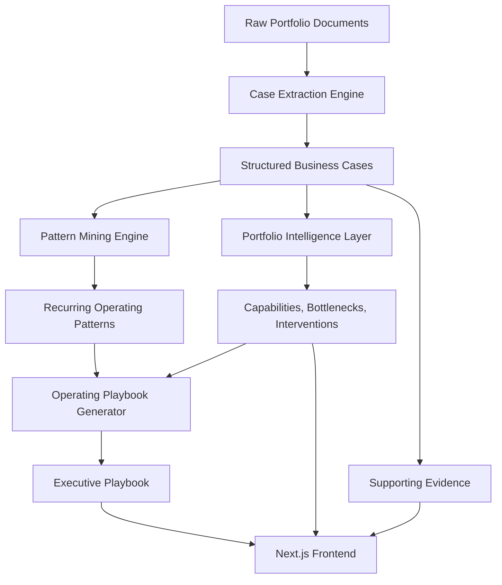

# Atlas

**Institutional Knowledge for Portfolio Scale**

Atlas is an AI-powered operating intelligence platform that helps investment and operating teams transform portfolio experience into reusable, evidence-backed operating playbooks.

Built for Summit Partners' Base Camp Builder-in-Residence application.

---

## Why Atlas

Investment firms accumulate valuable operating knowledge across portfolio companies: executive searches, AI adoption, support automation, engineering scaling, GTM improvements, and operational turnarounds.

But that knowledge often stays trapped inside documents, notes, emails, and individual experience.

Atlas turns that institutional knowledge into a reusable system.

Instead of asking, “What does this document say?” Atlas asks:

> Have we solved this operating problem before?

---

## What Atlas Does

Atlas helps operating teams:

- Extract structured business cases from portfolio documents
- Identify recurring patterns across prior engagements
- Surface common bottlenecks and successful interventions
- Generate executive-style operating playbooks
- Provide confidence scoring and supporting evidence
- Visualize portfolio knowledge through a polished frontend experience

---

## Core Demo Flow

A user asks:

> How should a Series B SaaS company build its first AI team?

Atlas then returns:

1. Relevant prior portfolio cases
2. Recurring patterns across those cases
3. A phased operating roadmap
4. Key risks
5. Recommendation confidence
6. Supporting evidence from structured cases

---

## Architecture



---

## Tech Stack

### Backend
- FastAPI
- Python
- Pydantic
- Modular service architecture

### Frontend
- Next.js
- TypeScript
- Tailwind CSS
- Custom design system
- Lucide icons

---

## Backend Modules

```text
backend/app/
├── main.py
├── case_extraction.py
├── pattern_engine.py
├── playbook.py
├── intelligence.py
├── retrieval.py
├── ingest.py
└── schemas.py
```

### `case_extraction.py`
Converts raw portfolio engagement notes into structured business cases.

### `pattern_engine.py`
Finds recurring themes, actions, lessons, and capabilities across cases.

### `playbook.py`
Generates evidence-backed operating playbooks with confidence scoring.

### `intelligence.py`
Surfaces portfolio-wide insights including capabilities, bottlenecks, and successful interventions.

---

## Frontend Experience

Atlas is intentionally not designed as a chatbot.

The interface is built as an executive operating workspace with:

- Portfolio health metrics
- Operating challenge input
- Recommended playbook
- Supporting evidence timeline
- Portfolio intelligence section
- Knowledge relationship visualization

The design direction is warm, premium, and editorial rather than generic AI dashboard styling.

---

## Running Locally

### Backend

```bash
cd backend
python -m venv venv
source venv/bin/activate
pip install -r requirements.txt
python -m uvicorn app.main:app --reload
```

Backend runs at:

```text
http://127.0.0.1:8000
```

Swagger docs:

```text
http://127.0.0.1:8000/docs
```

### Frontend

```bash
cd frontend
npm install
npm run dev
```

Frontend runs at:

```text
http://localhost:3000
```

---

## API Endpoints

```text
GET  /health
POST /extract-cases
GET  /intelligence
POST /patterns
POST /playbook
```

---

## Project Status

### Completed

- FastAPI backend
- Structured case extraction
- Pattern mining engine
- Portfolio intelligence layer
- Operating playbook generator
- Confidence scoring
- Evidence-backed recommendations
- Premium Next.js frontend

### Future Work

- PDF and email ingestion
- Authentication and workspace support
- Interactive knowledge graph
- Portfolio company filters
- Export playbooks to PDF
- Integrations with Notion, Slack, Google Drive, and CRMs
- Hosted backend deployment

---

## Why This Matters

Atlas is built around a simple idea:

> Every portfolio engagement should make the next recommendation smarter.

The goal is not just to automate research, but to help firms scale their operating knowledge across many companies.
